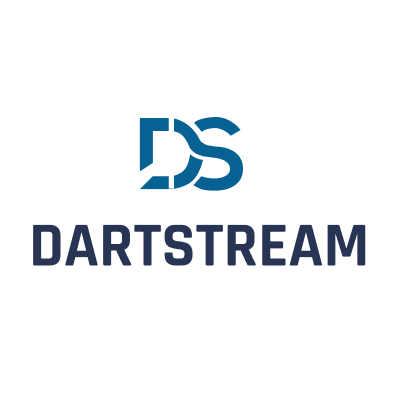

<div align="center">


</div>

# DartStream

DartStream is an open-source Dart-native framework for building backend
services, Flutter and Flame experiences, and frontend-agnostic integrations
around a stable set of engine, extension, and provider contracts.

The open-source project focuses on the framework foundation:

- the DartStream Standard Engine
- extension and provider contracts
- CLI tooling and project generation
- authentication, persistence, middleware, feature flags, reactive dataflow,
  AI, and ORM integration boundaries
- reference frontends and generated client patterns

DartStream SaaS is a separate managed Aortem product. It may use the
open-source standard engine as a base, but hosted control-plane services,
tenant operations, billing, provider credential management, and production SaaS
operations are outside this open-source repository.

## Core Capabilities

- **Standard Engine**: configuration, lifecycle, service registration, and
  extension management for DartStream applications.
- **Provider Contracts**: stable base packages for auth, persistence, storage,
  middleware, feature flags, reactive dataflow, AI, and ORM adapters.
- **Feature Control**: IntelliToggle is the official Aortem feature flag
  provider. `flagd` is the only other supported open-source feature flag
  provider lane.
- **AI-Ready Extensions**: `ds_ai_base` provides provider-neutral AI contracts
  so applications can integrate DartCodeAI or other current AI providers without
  hardcoding a provider into the framework.
- **ORM Integration**: `ds_orm_base` defines adapter contracts for current,
  actively maintained Dart ORM/data-mapping packages without making any ORM
  mandatory.
- **Frontend Reach**: Flutter and Dart are first-class. Nuxt and generated
  clients demonstrate non-Flutter frontend integration. Other examples are
  treated according to maturity.

## Getting Started

The framework workspace lives under `dartstream/backend`.

```bash
cd dartstream/backend
dart pub get
```

CLI docs and package docs are available under:

- `dartstream/backend/README.md`
- `dartstream/backend/packages/cli/ds_cli/README.md`
- `dartstream/docs/components/dartstream/modules/ROOT/pages`

## Documentation

Start with:

- `dartstream/docs/components/dartstream/modules/ROOT/pages/open-source-boundary.adoc`
- `dartstream/docs/components/dartstream/modules/ROOT/pages/package-maturity.adoc`
- `dartstream/docs/components/dartstream/modules/ROOT/pages/frontend-support.adoc`
- `dartstream/docs/components/dartstream/modules/ROOT/pages/feature-flags.adoc`
- `dartstream/docs/components/dartstream/modules/ROOT/pages/ai-extensions.adoc`
- `dartstream/docs/components/dartstream/modules/ROOT/pages/orm-integration.adoc`

## Support

Aortem provides open-source support for DartStream and other Aortem
open-source packages. For support, issue triage, and contribution guidance,
visit the Aortem support page:

https://aortem.io/support

## Contributing

Contributions are welcome. Keep changes scoped, preserve existing package
boundaries, and use the maturity labels in the docs to avoid presenting
experimental packages as production-ready.

See `CONTRIBUTING.md` for contribution details.

## Licensing

DartStream uses the repository license model described in `LICENSE`.

In short, the open-source framework packages are available for application use,
including commercial use, while offering DartStream or derivatives as a managed
third-party cloud service requires explicit permission from Aortem.
